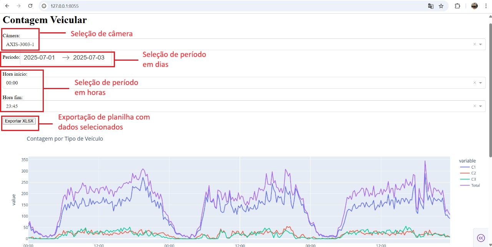
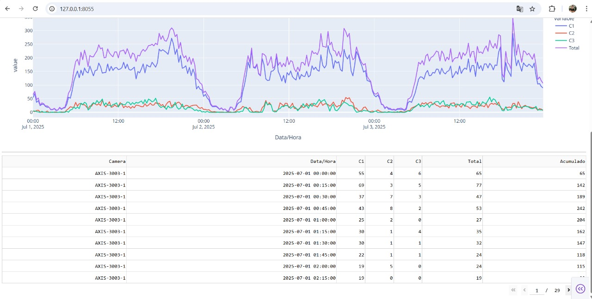

# app-vehicles-count
Dashboard web para visualização e exportação de dados.

Requisitos para execução local:
- Python 3.9 ou superior (Aplicação testada no Python 3.9 e 3.10);
- Base de dados local MariaDB disponível no endereço 127.0.0.1:3306 (A base local pode ser criada através do arquivo "Measeure.sql", disponível na pasta "CitilogMeasures.zip");
- Docker Engine para criação e execução do container.

🚀 Como Rodar Localmente

1️⃣ Criar e ativar um ambiente virtual

Clone o repo para uma pasta local e utilize os comandos a seguir em um terminal:

python -m venv .venv
source .venv/bin/activate  # Linux/Mac
.venv\Scripts\activate     # Windows

2️⃣ Instalar dependências
- pip install -r requirements.txt

4️⃣ Configurar variáveis de ambiente
Crie um arquivo .env na pasta do projeto e copie o conteúdo do arquivo ".env.example" para este arquivo. Altere os parâmetros a seguir de acordo com as suas configurações:  
DB_HOST = "localhost"
DB_USER = "usuario"
DB_PASS = "senha"
DB_NAME = "nome_banco"
DB_PORT = 3306

DashDASH_HOST=127.0.0.1
DASH_PORT=8055

Exemplo:
# Configuração do Banco de Dados
DB_HOST=localhost
DB_PORT=3306
DB_USER=root
DB_PASS=kjk540
DB_NAME=maestro_base

# Configuração do App 
DashDASH_HOST=127.0.0.1
DASH_PORT=8055
DEBUG=True

5️⃣ Rodar a aplicação
Execute o comando a seguir no terminal:
- python app.py

OBS: O arquivo excel exportado pela aplicação ficará disponível na pasta do projeto.

🚀 Como Rodar a imagem Docker
Para executar a aplicação através do container utilize 
- DB_HOST=host.docker.internal no arquivo .env

Exemplo de config:

# Configuração do Banco de Dados
DB_HOST=host.docker.internal
DB_PORT=3306
DB_USER=root
DB_PASS=kjk540
DB_NAME=maestro_base

# Configuração do App 
DashDASH_HOST=127.0.0.1
DASH_PORT=8055
DEBUG=True

Execute a Docker Engine e em seguida execute os seguintes comandos no terminal:

- docker buildx build --load -t nome-imagem:tag .
- docker run --env-file .env -p 8055:8055 nome-imagem:tag

Ex: 
docker buildx build --load -t contagem-veicular:tag .
docker run --env-file .env -p 8055:8055 contagem-veicular:tag

Para este exemplo a aplicação estará disponível no endereço 127.0.0.1:8055.
OBS: O arquivo excel exportado pela aplicação ficará disponível na pasta do projeto dentro do container.

Imagens - Aplicação sendo executada:

